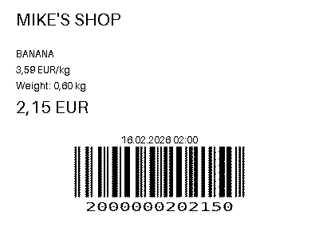

# Fruit Scanner Demo Concept

A proof-of-concept for an AI-supplemented self-checkout fruit/vegetable weighing scale.

Automatically selects which item is being weighed for its price tag through an AI model (Gemini 2.5 Flash). The model chooses the matching fruit from a list of fruits in stock.

In this demo environment, the "customer", instead of putting the fruit on the scale to be weighted, uploads an image and inputs the weight in the form on the website.

In a real world environment, the process would go along the lines of this: Upon pressing a button to print out the price tag for the item, the scale equipped with a camera would capture an image of the fruit and use it instead, along with the weight of the item.
The price tag being generated here uses a locally-based GTIN-barcode format.

# Setup

After cloning the repo and installing requirements.txt in your venv, create a .env file with your API key (API_KEY=...). After this you may run the app with "flask run".

For a list of fruits refer to labels.py.

# Example Price Tag Sticker

